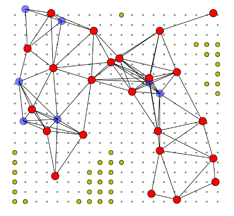

# pywsn

Wireless sensor networks simulator especially for node placement.

WARNING: It is not ready to use!

* red circle: significant nodes
* blue circle: redundant nodes that can be moved to other position
* small yellow circle: spots that can not be covered by both red and blue nodes